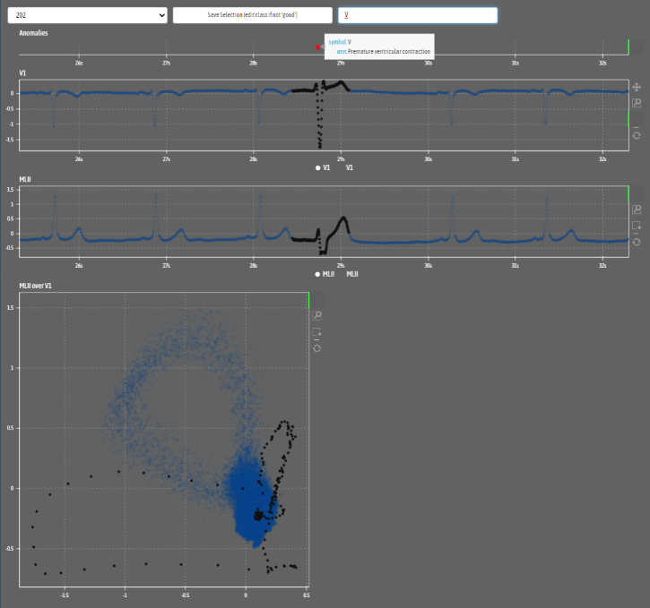

# Labelit Data Labeller

Bokeh server application that allows selection of portions of time series data and storing it. While similar applications exist 
(https://github.com/geocene/trainset or https://grafana.com/) these often cannot readily be installed in corporate IT environments, or, in the case of grafana, need specific databases to be set up.

Plus, its a showcase for bokeh server.

## Installation

* Please download https://fonts.google.com/specimen/Asap+Condensed and store AsapCondensed-Regular.ttf in the folder `labelit/static`
* We need bokeh https://docs.bokeh.org/en/latest/docs/installation.html package
* To create a data set, run the `Crunch ECG.ipynb` notebook, this needs wfdb https://pypi.org/project/wfdb/

## Run

From the command line, from this folder, run `bokeh serve labelit`. This should serve the page on a browser on [`http://localhost:5006`](http://localhost:5006). [Refer to the docs](https://docs.bokeh.org/en/latest/docs/reference/command/subcommands/serve.html) for further options, such as serving on `0.0.0.0`, allowing the bokeh served pages to be proxied via a web server (NB. bokeh uses web sockets) etc.

## Screenshot

